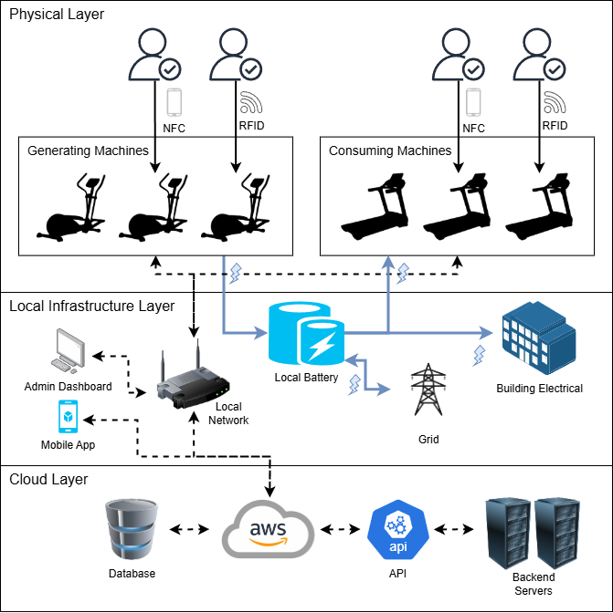

### MSIT 5910 Capstone Project — University of the People
**Student:** Ryan Bains-Jordan
**Supervisor:** Dr. Shabia Shabir
**Term:** AY2026-T4

---

## Overview

Power Plant Fitness is a conceptual IoT-integrated business management 
system designed to address the fitness industry's member retention 
crisis. The system converts physical energy generated by resistance-based 
exercise equipment into redeemable digital currency — called the 
**Watt Wallet** — rewarding members for their effort while contributing 
to the gym's broader sustainability goals.

This capstone project produces a complete system design portfolio 
including architecture diagrams, UI mockups, a normalized wattage credit 
algorithm deployed to AWS Lambda, and technical documentation.

---

## Prototype
[Figma Prototype](https://www.figma.com/proto/TFE1KgwRV0SOW2z0hlOhRC/Power-Plant-Fitness?node-id=5-12&scaling=scale-down-width&content-scaling=fixed&starting-point-node-id=2%3A2&page-id=0%3A1)

---

## System Architecture

The system is organized across three layers:

- **Physical Layer** — Generating and consuming exercise equipment, 
  RFID wearables, NFC-enabled smartphones, and the member-facing 
  mobile app
- **Local Infrastructure Layer** — Local battery and energy management 
  system, gym network, and the staff administrative dashboard
- **Cloud Layer** — AWS API Gateway manages the REST requests and responses while AWS Lambda executes the function



---

## Repository Structure
```text
power-plant-fitness/
├── diagrams/                           # System architecture and design diagrams
├── docs/
│   └── capstone_project_report.docx    # Capstone project technical report
├── mockups/                            # UI mockups for machine interface and dashboard
└── src/
    ├── watt_calculator.py              # Wattage credit normalization engine
    ├── lambda_function.py              # AWS Lambda deployment version
    ├── lambda_handler.py               # Inter-module communication example
    ├── machine_interface.py            # Simulated API request
    ├── test_watt_calculator.py         # PyTest unit test suite
    └── requirements.txt                # Python dependencies
```

---

## Core Feature: Watt Wallet

The Watt Wallet is the heart of the Power Plant Fitness concept. 
When a member completes a workout on a resistance-based machine, 
the system:

1. Authenticates the member via RFID wearable or smartphone NFC
2. Records real-time telemetry (wattage, duration, resistance level)
3. Applies a **normalized effort score** to ensure equitable credit 
   distribution across all fitness levels
4. Credits the calculated wattage to the member's Watt Wallet
5. Routes generated electricity to the gym's local battery system

Members can redeem Watt Wallet credits for rewards, participate in 
group challenges, and track their progress via the mobile app or 
machine touchscreen interface.

---

## Wattage Normalization Algorithm

The normalization engine (`/src/watt_calculator.py`) calculates the 
Watt Wallet credit applied to a member's account after each workout session.

The algorithm guarantees that every member always earns at least what 
they physically generated, with a single consistency bonus applied on top:

```python
consistency_bonus = min(sessions_last_30_days / target_sessions, 1.0)
bonus_multiplier = 1.0 + (consistency_bonus * 0.25)
normalized_credit = current_watts * bonus_multiplier
```

**Design principles:**
- **Base credit guaranteed** — no member ever earns less than their actual wattage output
- **Consistency rewarded** — members attending 12+ sessions per month earn up to 25% bonus
- **Grace period** — new members receive full bonus for their first 12 lifetime sessions
- **Ungameable** — physical attendance cannot be faked

**Why a single factor?**
Earlier versions used four multiplicative factors (duration, resistance, 
baseline, consistency) but produced compounding penalties that reduced 
legitimate sessions to near-zero credits. Consistency was retained as 
the sole modifier because it directly serves the retention goal, cannot 
be manipulated, and is equitable across all fitness levels.

**Live deployment:**
The algorithm is deployed as an AWS Lambda function behind an API Gateway 
endpoint. See `/src/lambda_function.py` for the cloud deployment version.

---

## Branching Strategy

| Branch | Purpose |
|--------|---------|
| `main` | Stable, submission-ready deliverables |
| `development` | Active work in progress |

All new diagrams, drafts, and source files are developed on the 
`development` branch and merged into `main` upon review and 
finalization. Commit messages follow a descriptive convention 
(e.g., `Add Unit 3 system architecture diagram`) to maintain a 
readable project history.

---

## Local Setup

```bash
# Clone the repository
git clone https://github.com/RyanBJ/capstone
cd capstone/src

# Install dependencies
pip install -r requirements.txt

# Run demo mode
python watt_calculator.py

# Run interactive mode
python watt_calculator.py -i

# Run unit tests
python -m pytest test_watt_calculator.py -v

# Test live API endpoint
python machine_interface.py
```

---

## Progress

| Unit | Deliverable | Status |
|------|------------|--------|
| 1 | Orientation and Problem Definition | ✅ Complete |
| 2 | Project Proposal & Planning | ✅ Complete |
| 3 | Detailed Design | ✅ Complete |
| 4 | Initial Implementation and Demo Presentation | ✅ Complete |
| 5 | Core Algorithm Implementation | ✅ Complete |
| 6 | Integration, Feature Completion, & Evaluation | ✅ Complete |
| 7 | Testing, Maintenance, & Documentation | ✅ Complete |
| 8 | Final Submission & Presentation | 🔄 In Progress |

---

## Technologies & Tools

| Tool    | Purpose                                 |
|---------|-----------------------------------------|
| Python  | Wattage credit normalization algorithm  |
| AWS     | Cloud hosting (backend, API, database)  |
| PyCharm | Software development IDE                |
| Draw.io | System architecture diagrams            |
| Figma   | UI mockup design                        |
| GitHub  | Version control and project traceability |
| MS Word | Document editor                         |

---

## License

This project is submitted in partial fulfillment of the requirements 
for the degree of Master of Science in Information Technology at the 
University of the People. All content is original work by the student 
unless otherwise cited.